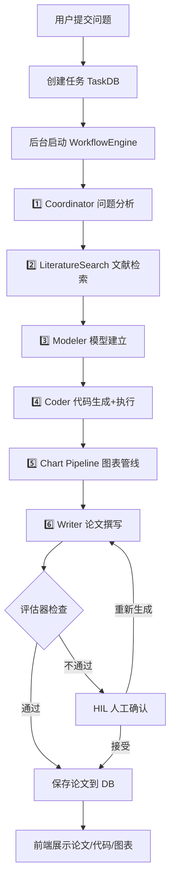
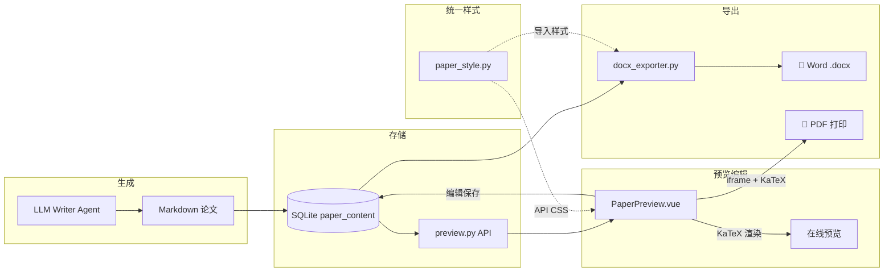
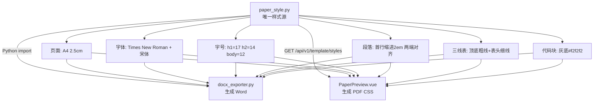
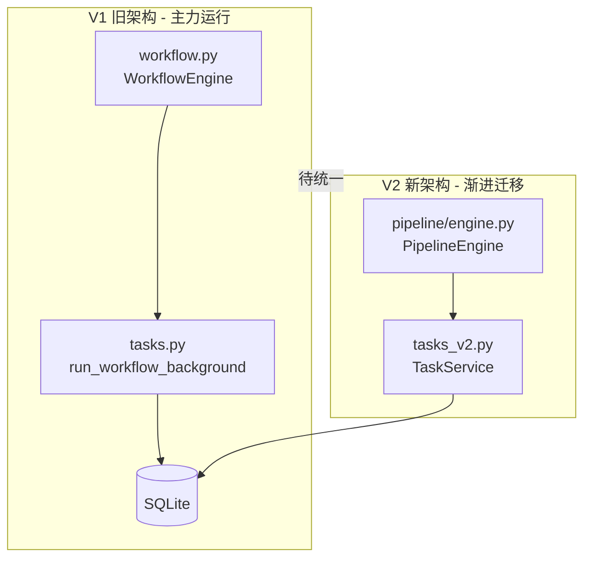

# MathModelPro 整体设计与模块架构

> 生成时间：2026-06-14 | 基于当前代码实际状态

---

## 一、系统全景架构

```
┌─────────────────────────────────────────────────────────────────────┐
│                         MathModelPro v2.0                            │
│                    AI 驱动的数学建模助手                               │
├─────────────────────────────────────────────────────────────────────┤
│                                                                      │
│  ┌─────────────────────┐          ┌─────────────────────────────┐   │
│  │   前端 (Vue3 + TS)   │  HTTP    │     后端 (FastAPI + Python)  │   │
│  │    localhost:5173    │◄───────►│     127.0.0.1:8001          │   │
│  │                      │  /api/v1 │                              │   │
│  │  TaskDetail.vue      │  /api/v2 │  ┌───────────────────────┐  │   │
│  │  PaperPreview.vue    │          │  │   V1 API (旧架构)      │  │   │
│  │  FiguresGallery.vue  │          │  │   tasks.py             │  │   │
│  │  FileSheet.vue       │          │  │   preview.py           │  │   │
│  │  ChatPanel.vue       │  WebSocket│  │   settings.py          │  │   │
│  └─────────────────────┘  /ws      │  │   chat.py              │  │   │
│                                     │  │   progress.py          │  │   │
│                                     │  └───────────────────────┘  │   │
│                                     │                               │   │
│                                     │  ┌───────────────────────┐  │   │
│                                     │  │   V2 API (新架构)      │  │   │
│                                     │  │   tasks_v2.py          │  │   │
│                                     │  │   settings_v2.py       │  │   │
│                                     │  └───────────────────────┘  │   │
│                                     │                               │   │
│                                     │  ┌───────────────────────┐  │   │
│                                     │  │   核心引擎              │  │   │
│                                     │  │   workflow.py          │  │   │
│                                     │  │   evaluator.py         │  │   │
│                                     │  │   interpreter.py       │  │   │
│                                     │  └───────────────────────┘  │   │
│                                     │                               │   │
│                                     │  ┌───────────────────────┐  │   │
│                                     │  │   共享工具              │  │   │
│                                     │  │   paper_style.py  ←──  │  │   │
│                                     │  │   docx_exporter.py     │  │   │
│                                     │  │   llm_config.py        │  │   │
│                                     │  └───────────────────────┘  │   │
│                                     └──────────────────────────────┘   │
│                                                                      │
│  ┌──────────────────────────────────────────────────────────────┐   │
│  │                     外部服务                                   │   │
│  │   DeepSeek API (LLM)  │  SQLite (本地DB)  │  Redis (消息队列)  │   │
│  └──────────────────────────────────────────────────────────────┘   │
└─────────────────────────────────────────────────────────────────────┘
```

---

## 二、核心业务流程

### 2.1 任务建模全流程



### 2.2 论文全生命周期



### 2.3 统一模板系统（今天新建）



---

## 三、模块设计

### 3.1 模块总览

| 模块 | 位置 | 职责 | 关键文件 |
|------|------|------|---------|
| **API 层** | `app/api/` | HTTP 路由，请求响应 | tasks.py, preview.py, settings.py, chat.py, progress.py |
| **核心引擎** | `app/core/engine/` | 建模流水线，LLM 编排 | workflow.py, evaluator.py, interpreter.py |
| **领域模型** | `app/domain/` | V2 新架构 Agent | agent/writer.py, agent/coder.py, pipeline/engine.py |
| **共享工具** | `app/utils/` | Word导出、样式配置、LLM配置 | docx_exporter.py, paper_style.py, llm_config.py |
| **数据层** | `app/models/` | 数据库 ORM | database.py (TaskDB) |
| **服务层** | `app/services/` | Redis 消息队列 | redis_manager.py |
| **基础设施** | `app/infrastructure/` | V2 仓储、沙箱 | repository.py, sandbox.py |
| **前端页面** | `frontend/src/pages/` | 任务详情、论文预览 | TaskDetail.vue, PaperPreview.vue |
| **前端状态** | `frontend/src/stores/` | Pinia Store | taskStore.ts |
| **前端工具** | `frontend/src/utils/` | Markdown 渲染 | markdown.ts |

### 3.2 API 路由分布

```mermaid
flowchart LR
    subgraph V1 API [V1 稳定运行]
        A1[tasks.py<br/>/api/v1/tasks/*]
        A2[preview.py<br/>/api/v1/preview/*]
        A3[settings.py<br/>/api/v1/settings/*]
        A4[chat.py<br/>/api/v1/chat/*]
        A5[progress.py<br/>/api/v1/ws/*]
    end
    subgraph V2 API [V2 新架构]
        B1[tasks_v2.py<br/>/api/v2/tasks/*]
        B2[settings_v2.py<br/>/api/v2/settings/*]
    end
    
    Frontend[前端] --> V1 API
    Frontend --> V2 API
```

### 3.3 论文模块架构（今天重点改造）

```
paper_style.py  ←── 统一样式定义（唯一源）
    │
    ├─ 页面: A4, 2.5cm 边距
    ├─ 字体: Times New Roman, 宋体, Courier New, Cambria Math
    ├─ 字号: h1=17pt, h2=14pt, h3=12pt, body=12pt, code=10pt
    ├─ 段落: 首行缩进 2em, 两端对齐, 行高 1.8
    ├─ 三线表: 顶底 1.5pt 粗线, 表头下 0.75pt 细线
    └─ 代码块: 背景 #f2f2f2, 边框 0.8pt, 内边距 0.7em
         │
    ┌────┴────┐
    │         │
    ▼         ▼
docx_exporter.py      PaperPreview.vue
(python-docx)         (iframe + CSS)
    │         │
    ▼         ▼
  .docx       浏览器打印 PDF
```

### 3.4 论文导出路径对比

| 维度 | Word (.docx) | PDF (浏览器打印) |
|------|-------------|-----------------|
| 引擎 | python-docx | iframe + KaTeX + CSS |
| 样式源 | `paper_style.py` (Python import) | `GET /api/v1/template/styles` (API → CSS) |
| 公式 | `_clean_math()` LaTeX→Unicode | KaTeX 客户端渲染 |
| 图片 | `add_picture()` 嵌入原图 | `` 标签引用 |
| 三线表 | `_apply_three_line_table()` | CSS `thead/tbody` 边框 |
| 首行缩进 | `first_line_indent = Cm(0.74)` | `p { text-indent: 2em }` |

---

## 四、数据模型

### 4.1 TaskDB 表结构

| 列名 | 类型 | 说明 |
|------|------|------|
| id | String(36) PK | 任务 ID |
| name | String(255) | 任务名称 |
| problem_text | Text | 原始问题 |
| language | String(20) | python |
| template_id | String(100) | cumcm / mcm |
| status | String(20) | pending→running→completed/failed |
| progress | JSON | {analysis, modeling, coding, paper, overall} |
| **paper_content** | **Text** | **Markdown 论文** |
| code | Text | 生成代码 |
| figures | JSON | 图片文件名列表 |
| literature | JSON | 文献检索结果 |

### 4.2 文件系统

```
backend/project/{task_id}/
├── figure_1.png          ← 代码生成的图表
├── figure_2.png
└── ...                   ← 论文中引用的图片

导出时:
├── paper.md              ← paper_content 写入
├── code.py               ← code 写入
└── *.png                 ← figures 复制
```

---

## 五、V1/V2 双轨现状



**当前状态**：V1/V2 并行，V1 承担主要流量，V2 仅有基础框架。

---

## 六、技术栈

| 层 | 技术 |
|----|------|
| 前端框架 | Vue 3 + TypeScript + Vite |
| UI | Tailwind CSS |
| 状态管理 | Pinia |
| Markdown | marked + marked-katex-extension |
| 后端框架 | FastAPI (Python 3.13) |
| 数据库 | SQLite + SQLAlchemy ORM |
| 消息 | Redis (降级内存模式) |
| LLM | DeepSeek v4 (via litellm) |
| Word | python-docx |
| PDF | 浏览器 KaTeX + window.print() |
| 启动 | launcher.py (统一入口) |

---

## 七、今天改动总结（2026-06-14）

### 新增模块
- **`paper_style.py`** — Word/PDF 统一样式源
- **`docx_exporter.py`** — Markdown→Word 引擎（558行）
- **设计规则** — `CLAUDE.md` 项目级规则

### 修改模块
- `workflow.py` — 图表图片聚合
- `tasks.py` — Word 导出端点
- `settings.py` — 模板样式 API
- `main.py` — lifespan→@app.on_event
- `launcher.py` — GBK 编码兼容
- `PaperPreview.vue` — PDF iframe+KaTeX+动态CSS
- `TaskDetail.vue` — Word 导出按钮
- `taskStore.ts` — exportDocx 方法

### 收益
1. Word 和 PDF 共享同一套模板配置
2. 修改 `paper_style.py` 一处，两端同步生效
3. 数学公式零残留（表格 0，段落 0）
4. 三线表、首行缩进、两端对齐符合 CUMCM 规范
